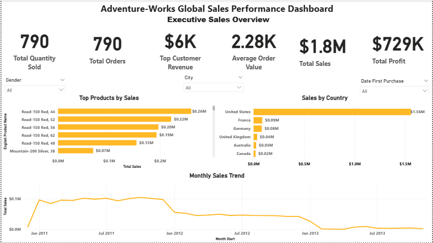
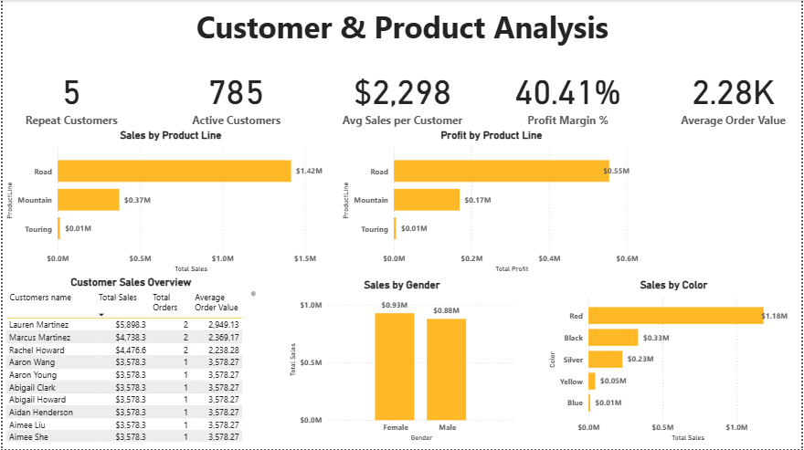

# AdventureWorks Sales Performance Dashboard

An interactive Power BI dashboard built to analyze AdventureWorks sales performance, profitability, customer behavior, product performance, and regional sales.

The project demonstrates practical data analysis, data modeling, DAX calculations, and dashboard design skills used to transform business data into actionable insights.

---

## 📊 Project Overview

This project analyzes AdventureWorks sales data to provide a clear view of overall business performance.

The dashboard was designed around two analytical perspectives:

### 1. Executive Sales Overview
Provides a high-level view of sales performance through key KPIs, product performance, country-level sales, and monthly sales trends.

### 2. Customer & Product Analysis
Provides deeper analysis of customer purchasing behavior, product-line performance, profitability, gender-based sales, product colors, and individual customer sales.

---

## 🎯 Business Objectives

The dashboard was developed to answer questions such as:

- How much revenue and profit is the business generating?
- How many orders and products are being sold?
- Which products generate the highest sales?
- Which product lines contribute most to revenue and profit?
- Which countries generate the most sales?
- How does sales performance change over time?
- How many active and repeat customers are there?
- What is the average sales value per customer?
- How do sales vary by gender and product color?
- Which customers generate the highest sales?

---

## 🛠️ Tools & Technologies

- **Microsoft Power BI** — Dashboard development, data modeling, visualization, and reporting
- **Power Query** — Data cleaning and transformation
- **DAX** — Measures, KPIs, profitability calculations, and customer analysis
- **Microsoft Excel** — Initial dataset inspection and validation before importing the data into Power BI
- **AI-assisted analysis** — Supported problem-solving, formula development, dashboard design decisions, and project documentation
- **GitHub** — Project documentation and portfolio presentation

---

## 📈 Key KPIs

The dashboard tracks several important business performance indicators, including:

- Total Sales
- Total Profit
- Total Orders
- Total Quantity Sold
- Average Order Value
- Profit Margin
- Active Customers
- Repeat Customers
- Average Sales per Customer
- Top Customer Revenue

---

## 📊 Dashboard Pages

### Executive Sales Overview

The executive dashboard provides a high-level summary of business performance.

Key visualizations include:

- Sales and profit KPIs
- Top products by sales
- Sales by country
- Monthly sales trend
- Customer and purchase filters



---

### Customer & Product Analysis

The second dashboard provides a deeper analysis of customers and products.

Key visualizations include:

- Sales by product line
- Profit by product line
- Customer sales overview
- Sales by gender
- Sales by product color
- Customer-level sales and order analysis



---

## 🔍 Key Analytical Areas

### Sales Performance
Analysis of total revenue, orders, quantity sold, and average order value.

### Profitability
Calculation and analysis of total profit and profit margin using product standard costs and sales values.

### Customer Analysis
Analysis of active customers, repeat customers, average sales per customer, and customer-level revenue.

### Product Analysis
Comparison of sales and profitability across different product lines and products.

### Regional Performance
Analysis of sales performance across different countries.

### Time-Based Analysis
Monthly sales trends used to understand changes in sales performance over time.

---

## 🧮 Data Modeling & DAX

The project uses a relational Power BI data model connecting sales, product, customer, geography, and date information.

Key DAX measures were created for metrics such as:

- Total Sales
- Total Profit
- Total Orders
- Total Quantity Sold
- Average Order Value
- Profit Margin %
- Active Customers
- Repeat Customers
- Average Sales per Customer

A dedicated date dimension was also created to support time-based analysis and monthly sales trends.

---

## 📂 Project Structure

```text
AdventureWorks-Sales-Performance-Dashboard/
│
├── AdventureWorks-Sales-Performance-Dashboard.pbix
│
├── Screenshots/
│   ├── Executive-Sales-Overview.png
│   └── Customer-Product-Analysis.png
│
└── README.md
